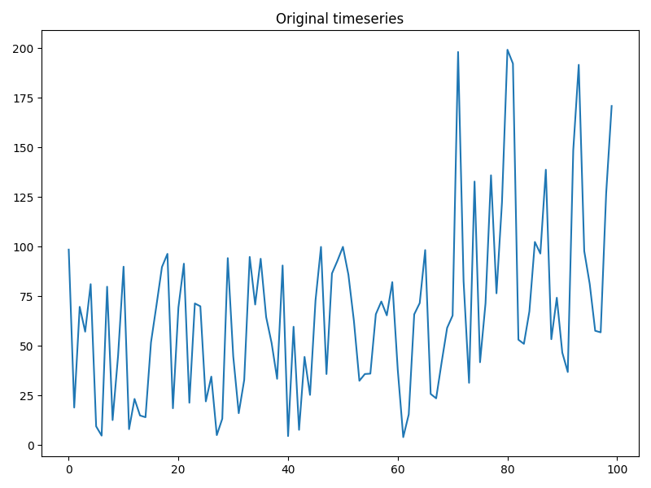
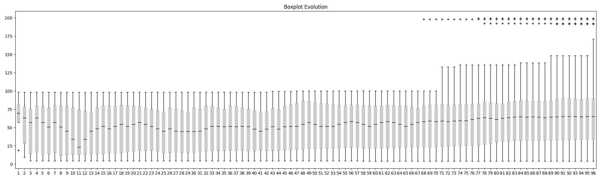
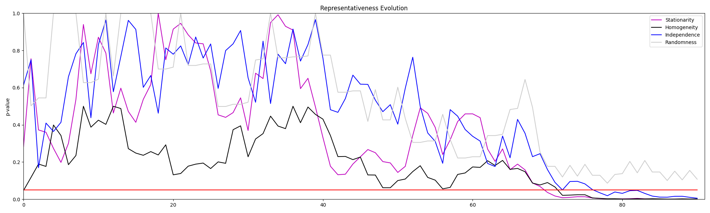

# Time Series Representativeness (RHIS)

Functions for analyses of statistical characteristics of time series.

# Methods

The evolution of 4 properties of a time series are analyzed simultaneously:

* **Randomness**
* **Homogeneity**
* **Independence**
* **Stationarity**

For a random sample from a population (a time series) it is expected that these properties (**hypothesis**) are met. When it does not happen, the series is likely to have a variability pattern. Some patterns are:

* **Trends**
* **Seasonality**
* **Shifts**

## Hypotheses tests (RHIS)

* **Runs Test** (randomness)
* **Mann-Whitney** (homogeneity)
* **Wald-Wolfovitz** (independence)
* **Mann-Kendall** (stationarity/trend)

## Scientific foundations

[Uncertainty analysis in the detection of trends, cycles, and shifts in water resources time series](https://link.springer.com/article/10.1007/s11269-019-02210-1)

# Run these to see an example

```
poetry config --local virtualenvs.in-project true
```
```
poetry install
```
```
python ../time_series_analyses/main.py
```

# Example

## Time series



## Boxplots evolution



## RHIS


