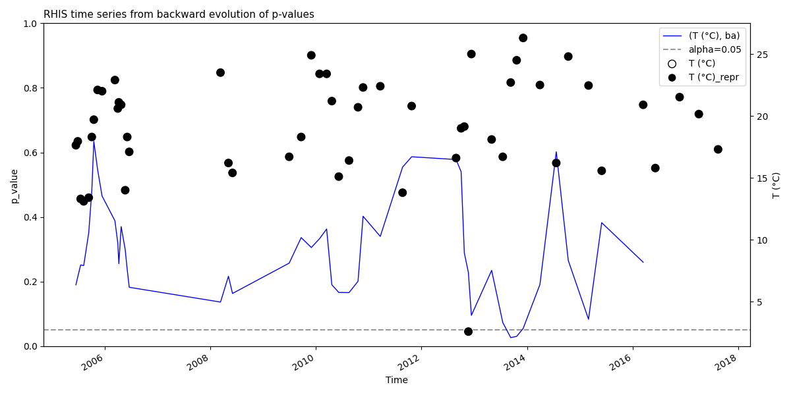

# RHIS

This repository presents four methods that can be applied simultaneously to time series to detect variability patterns. Essentially, these methods assess whether a time series meets the basic assumptions required for statistical representativeness. In other words, the use of statistical methods for frequency analysis depends on whether the data satisfy the hypotheses of randomness, homogeneity, independence, and stationarity (RHIS).

If at least one of these hypotheses is rejected, there is a high likelihood that a variability pattern, such as a trend, shift, and/or seasonality, is present in the time series. In such cases, statistical methods may not produce representative results.

To obtain representative results, an appropriate period of data should be selected — one that reflects the current conditions and can potentially be used to support planning for future periods.

In the context of water resources management, for example, the continuous and unplanned expansion of cities causes rainfall runoff to reach river channels more quickly due to increased soil impermeabilization. As a result, streamflow data may increase year after year, indicating a trend in the time series.

When this trend is statistically confirmed, a strategy for data selection or treatment should be implemented. Ultimately, the selected data should satisfy the RHIS hypotheses.

## How this package can help you?

When determining whether a time series is representative, the first step is to apply the RHIS tests to the complete time series. If one or more hypotheses are rejected, one possible strategy is to select a period within the time series that better represents the current conditions.

However, the goal is to retain as much information as possible, so the longest RHIS-compliant period should be selected. This means that the data selection process requires testing the RHIS hypotheses each time a new observation is added to the selected period. This is where this program comes in.

The program provides a method for applying the RHIS tests to a time series with an increasing number of observations. The analysis starts with a small number of observations, such as the first 5 or 10, and then adds one observation at a time. The RHIS tests are performed each time the number of observations increases.

When the test results are plotted sequentially, it becomes possible to identify the point at which the data first become fully compliant with the RHIS hypotheses. If a representative period exists, this point can be used as a boundary for selecting the data. In this way, the method identifies the longest period that satisfies all RHIS requirements while retaining as much information as possible.

## Methods - Hypothesis (RHIS)

* **Runs Test** - randomness
* **Mann-Whitney** - homogeneity
* **Wald-Wolfovitz** - independence
* **Mann-Kendall** - stationarity (trend)

### Randomness

Briefly, the runs test checks whether there are too many values above or below the median or whether another pattern exists in the sequence of values relative to the median. Randomness is rejected if a statistically significant pattern is detected at the chosen significance level.

### Homogeneity

The homogeneity test checks whether the two halves of the time series are statistically equivalent. Homogeneity is rejected if one half is significantly greater or smaller than the other at the chosen significance level.

### Independence

A time series has dependence when one observation influences or is related to the following observations. For example, after a period of heavy rainfall, daily streamflow measurements may follow a pattern in which flows gradually increase or decrease as groundwater continues to contribute to the river. A similar pattern can occur after rainfall stops, as the streamflow gradually decreases.

Independence is rejected when this type of temporal dependence is statistically significant at the chosen significance level.

## Stationarity

When a time series consistently increases or decreases over time, it is considered non-stationary. The stationarity hypothesis is rejected when this behavior is statistically significant at the chosen significance level.

## Scientific foundations

These tests were used in my doctoral thesis to assess the representativeness of water quality time series in the Alto Iguaçu Watershed in southern Brazil.

If you are interested, please check out the article below.

[Uncertainty analysis in the detection of trends, cycles, and shifts in water resources time series](https://link.springer.com/article/10.1007/s11269-019-02210-1)

## Run these commands to see an example

```bash
python -m venv .venv
```

```bash
.venv/scripts/activate
```

```bash
pip install -e .[dev]
```

```bash
rhis-ts
```

## Using RHIS

```py
import pandas as pd
from rhis import Rhis

df = pd.read_csv("data.csv")

rhis = Rhis(df)
rhis.evol(stat="min")
rhis.plot()
```

## Example

### Representative Selection Using RHIS Evol

In this example, the RHIS evolution was used to select a representative slice of the original time series in a dataframe. The selected slices (black painted dots) are compliant with the hypotheses of randomness, homogeneity, independence, and stationarity. The selected slice is appropriate for using in statistical methods, such as mean, standard deviation, and others.

The dashed grey line represents the forward evolution of the minimum value among the four p-values from RHIS. The first value is the result from the application of the **RHIS** tests on the first 5 values and taken the minimum, and the last one is the result from the application on the entire time series.


