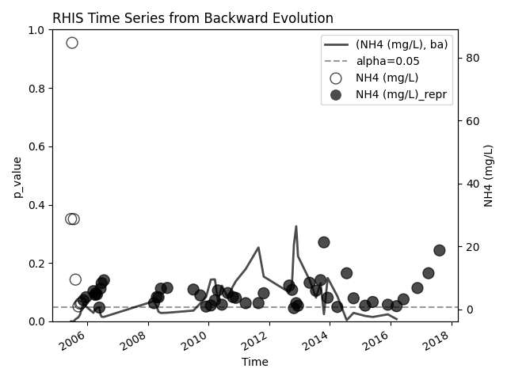

# Time Series Representativeness (RHIS)

This repository presents 4 methods that can be simultaneously applied in time series for variability patterns detection. Essentially, these methods check if the time series are compliant with the basic assumptions for statistical representativeness, i. e., the application of statistical methods for frequency analysis depends on the compliance with the hypotheses of randomness, homogeneity, independence, and stationarity (RHIS). If at least one of these hypotheses is rejected, it means that there is high chance for the presence of a variability pattern, such as trend, shift, and/or seasonality. In this situation, statistical methods likely will not produce representative results. In order to get representativeness, a period of data should be selected, which actually represents the current conditions and can possibly be used for planning future periods. 

Generally, there are 3 patterns that can cause rejection of RHIS hypotheses:

* **Trends**
* **Seasonality**
* **Shifts**

In the context of water resources management, for example, the continuous and disordered urban expansion processes iof cities makes the waters from rain to reach the river channel each time faster due to waterproofing of the soil. So, the streamflow data becomes greater year after year characterizing a trend in the time series. When this is statistically confirmed, an strategy for data selection or treatment should be implemented. Finally, the selected data must then be compliant with the RHIS hypotheses.

# How this package can help you?

When you want to know if a time series is representative, the first thing to do is to apply the RHIS tests in the complete time series. If one or more hypotheses are rejected, one strategy is to select only a period of the data where the actual characteristics are represented. However, we have to include the maximum quantity of information by selecting the maximum data we can. This selection period must be RHIS-compliant, so we would have to test every time we include one more data in the selection. Here is where this program comes in. 

It provides a method that applies the RHIS hypotheses in a time series with an increasing number of elements. The initial time series will have only the first 5 or 10 elements and then this number will be increasing one by one, and the tests applied each time this number increases. When the results of the tests are plotted in sequence, if there is a representative period, it will be possible to see the exact time when data starts to be complete compliant and you should select the data considering this point as a divisor. 

# Methods - Hypothesis (RHIS)

* **Runs Test** - randomness
* **Mann-Whitney** - homogeneity
* **Wald-Wolfovitz** - independence
* **Mann-Kendall** - stationarity (trend)

## Randomness

Briefly, the runs method checks if there are too many values above or below the median or if there is another pattern in the positioning of the values above and below the median. Randomness is rejected if a pattern is detected for a given significance level.

## Homogeneity

The homogeneity test checks if the halves of the time series are statistically equal. Homogeneity is rejected if one of the halves is greater or smaller than the other, for a given significance level.

## Independence

A time series has dependency when a value influences the next. For example, if it rains a lot one day and it stops, the daily streamflow measurements of the next days will have a pattern, being each day higher while the underground water keeps flowing into the river, and the opposite when it stops flowing. Independece is rejected if this kind of pattern occurs, for a given significance level.

## Stationarity

When a time series consistently increases or decreases with time, it is considered non-stationary if the hypothesis is rejected for a given significance level.


# Scientific foundations

These tests were used in my doctorate thesis to check the representativeness of water quality time series in the Alto Iguaçu Watershed in the south of Brazil.

If you are interested, please check the article below.

[Uncertainty analysis in the detection of trends, cycles, and shifts in water resources time series](https://link.springer.com/article/10.1007/s11269-019-02210-1)

# Run to see an example

```
python -m venv .venv
```
```
.venv/scripts/activate
```
```
pip install -e .[dev]
```
```
rhis-ts
```

# Example

## Respresentative Selection Using RHIS Evol

In this example, the RHIS evolution was used to select a representative slice of the original time series. The selected slice is compliant with the hypotheses of randomness, homogeneity, independence, and stationarity. The selected slice is appropriate for using in statistical methods, such as mean, standard deviation, and others.

The dashed grey line represents the forward evolution of the minimum value among the four p-values from RHIS. The first value is the result from the application of the **RHIS** tests on the first 5 values and taken the minimum, and the last one is the result from the application on the entire time series.


