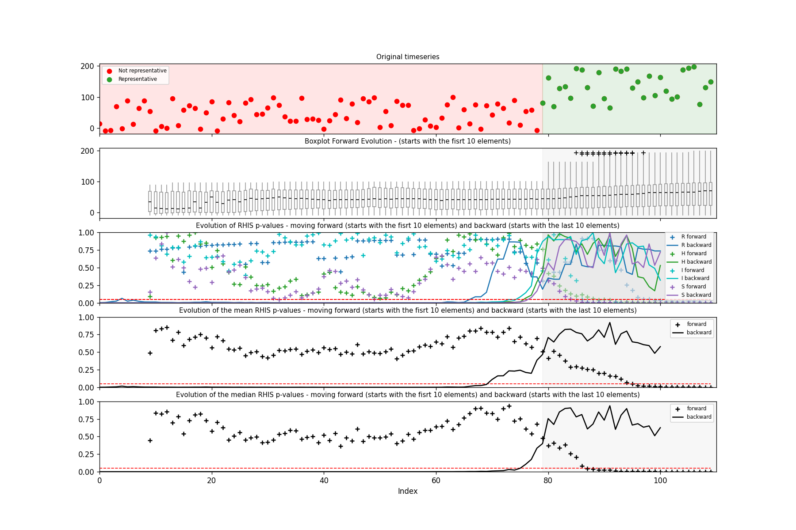

# Time Series Representativeness (RHIS)

This repository presents four methods for the detection of variability patterns in time series. Essentially, it is checked if the time series are compliant with the basic assumptions for statistical representativeness, i. e., to be able for the application of statistical methods for frequency analysis, a time series must be compliant with the hypothesis of randomness, homogeneity, independence and stationarity (RHIS). In other words, the methods check if all sample data comes from the same population.

Basically, there are three patterns that can make the RHIS hypotheses to be rejected:

* **Trends**
* **Seasonality**
* **Shifts**

In the context of water resources management, for example, the continuous and uncontrolled urban expansion process in the cities makes the waters from rain to reach the river channel each time faster due to waterproofing of the soil. So, the streamflow data becomes greater year after year characterizing a trend. When this is statistically confirmed, an strategy for data selection or treatment should be implemented.

# Methods - Hypothesis (RHIS)

* **Runs Test** - randomness
* **Mann-Whitney** - homogeneity
* **Wald-Wolfovitz** - independence
* **Mann-Kendall** - stationarity (trend)

## Randomness

Briefly, the runs method checks if there are too many values above or below the median or if there is another pattern in the positioning of the values above and below the median. Randomness is rejected if a pattern is detected for a given significance level.

## Homogeneity

The homogeneity test check if the halves of the time series are statistically equal. Homogeneity is rejected if one of the halves is greater or smaller than the other, for a given significance level.

## Independence

A time series has dependency when a value influences the next. For example, if it rains a lot one day and it stops, the daily streamflow measurements of the next days will have a pattern, being each day higher while the underground water keeps flowing into the river, and the opposite when it stops flowing. Independece is rejected if this kind of pattern occur, for a given significance level.

## Stationarity

When a time series increase or decrease with time, it is said to be a non-stationary series if the hypothesis is rejected for a given significance level.


# Scientific foundations

These tests were used in my doctorate thesis to check the representativeness of water quality time series in the Alto Iguaçu Watershed in the south of Brazil.

If you are interested, please check the article below.

[Uncertainty analysis in the detection of trends, cycles, and shifts in water resources time series](https://link.springer.com/article/10.1007/s11269-019-02210-1)

# Run to see an example

```
python -m venv .venv
```
```
pip install -e .[dev]
```
```
rhis-ts
```

# Example

The RHIS tests were applied to increasing slices from a time series.

For example:

```py
ts = [22, 10, 30, 4, 25, 12, 7]

slices = [[22, 10, 30, 4, 25], [22, 10, 30, 4, 25, 12], [22, 10, 30, 4, 25, 12, 7]]
```

The results from RHIS test would be like:

```py
evol_rhis = {
        'randomness': [0.234, 0.321, 0.001],
        'homogeneity': [0.532, 0.731, 0.091],
        'independence': [0.444, 0.624, 0.656],
        'stationarity': [0.121, 0.000, 0.001],
    }
```

In this way, the first p-values are the result from rhis tests applied in the first 5 values of the time series, and the last p-values are the result from rhis tests applied in the entire time series.
    
In these example you can see a time series which has an up shift after the 80th value. So, it clearly shows that something has changed in the process that generates these data. So it would not be reasonable to estimate statistical parameters with the whole data, since two different populations might be present. In the boxplots you can see that the median, the 25th and 75th and higher percentiles are increasing from the 80th value. It shows that the whole population distribution is changing over time.

The last graph confirms that indeed, the statictical characteristics of the population has changed after the 80th value. The homogeneity, independence and stationarity hypotheses are rejected right after this value. The p-values for these hypotheses goes to 0 after this point. Despite randomness was not rejected, it had a significant decrease. Anyway, the rejection of one of these 4 hypotheses is enough to conclude that the time series is no longer representative of only one population after this point.

With that in mind, one should decide which part of the time series to use to calculate statistical parameters or make any inference analysis. It will depend on each ones objectives.

## Time series


## Boxplots evolution


## RHIS


